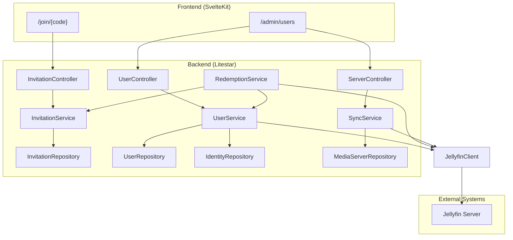
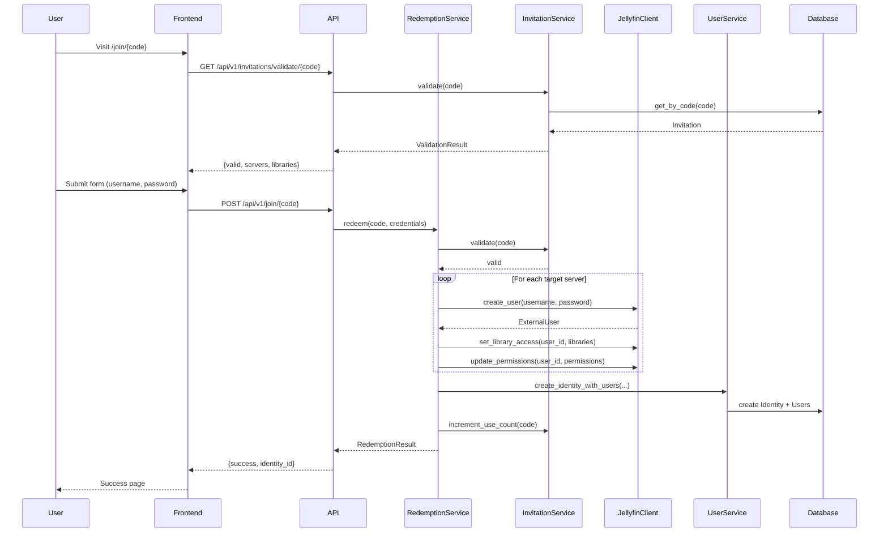
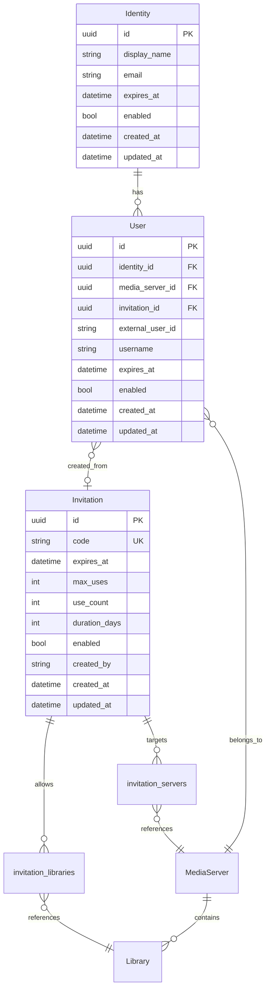

# Design Document: Phase 2 - Jellyfin Integration

## Overview

This design document specifies the technical implementation for Phase 2 of the Zondarr media server user management system. The phase delivers four major components:

1. **JellyfinClient Implementation** - Complete implementation of the MediaClient protocol for Jellyfin servers using the jellyfin-sdk library
2. **Invitation CRUD API** - REST endpoints for managing invitations with full lifecycle support
3. **Invitation Redemption Flow** - Public endpoints for validating and redeeming invitation codes with automatic user provisioning
4. **User Management & Sync** - User listing, management actions, and server synchronization

The implementation follows established patterns from Phase 1: repository pattern, service layer orchestration, msgspec Structs for DTOs, and Litestar controllers with dependency injection.

## Architecture

### System Context



### Request Flow - Invitation Redemption



## Components and Interfaces

### File Structure

```
backend/src/zondarr/
├── media/
│   ├── clients/
│   │   └── jellyfin.py          # JellyfinClient implementation (MODIFY)
│   ├── permissions.py           # Universal permission model (NEW)
│   └── types.py                 # Add JellyfinUserPolicy struct (MODIFY)
├── api/
│   ├── controllers/
│   │   ├── invitations.py       # InvitationController (NEW)
│   │   ├── users.py             # UserController (NEW)
│   │   └── servers.py           # ServerController sync endpoint (NEW)
│   └── schemas.py               # Add new DTOs (MODIFY)
├── services/
│   ├── invitation.py            # InvitationService (MODIFY)
│   ├── user.py                  # UserService (NEW)
│   ├── redemption.py            # RedemptionService (NEW)
│   └── sync.py                  # SyncService (NEW)
├── repositories/
│   ├── invitation.py            # InvitationRepository (MODIFY)
│   ├── user.py                  # UserRepository (NEW)
│   └── identity.py              # IdentityRepository (NEW)
└── app.py                       # Register new controllers (MODIFY)

frontend/src/
├── routes/
│   ├── (public)/
│   │   └── join/
│   │       └── [code]/
│   │           ├── +page.svelte      # Join form UI (NEW)
│   │           └── +page.server.ts   # Server-side validation (NEW)
│   └── (admin)/
│       └── users/
│           ├── +page.svelte          # User list UI (NEW)
│           └── +page.server.ts       # User data loading (NEW)
└── lib/
    └── api/
        └── client.ts                 # openapi-fetch client (NEW)
```

### JellyfinClient Implementation

The implementation follows the backend guidelines:
- Uses Python 3.14 features (deferred annotations, Self type)
- Positional-only and keyword-only parameters where appropriate
- Proper async context manager pattern
- msgspec Structs for data transfer

```python
# backend/src/zondarr/media/clients/jellyfin.py

from collections.abc import Mapping, Sequence
from typing import Self

import jellyfin

from zondarr.media.exceptions import MediaClientError
from zondarr.media.types import Capability, ExternalUser, LibraryInfo


class JellyfinClient:
    """Jellyfin media server client using jellyfin-sdk.

    Implements the MediaClient protocol for Jellyfin servers.
    Uses jellyfin-sdk for high-level API access with method chaining.

    Attributes:
        url: The Jellyfin server URL.
        api_key: The API key for authentication.
    """

    url: str
    api_key: str
    _api: jellyfin.api | None

    def __init__(self, *, url: str, api_key: str) -> None:
        """Initialize a JellyfinClient.

        Args:
            url: The Jellyfin server URL (keyword-only).
            api_key: The API key for authentication (keyword-only).
        """
        self.url = url
        self.api_key = api_key
        self._api = None

    @classmethod
    def capabilities(cls) -> set[Capability]:
        """Return the set of capabilities this client supports.

        Jellyfin supports all standard capabilities including
        download permission management.
        """
        return {
            Capability.CREATE_USER,
            Capability.DELETE_USER,
            Capability.ENABLE_DISABLE_USER,
            Capability.LIBRARY_ACCESS,
            Capability.DOWNLOAD_PERMISSION,
        }

    async def __aenter__(self) -> Self:
        """Enter async context, establishing connection.

        Initializes the jellyfin-sdk API client.
        """
        self._api = jellyfin.api(self.url, self.api_key)
        return self

    async def __aexit__(
        self,
        exc_type: type[BaseException] | None,
        exc_val: BaseException | None,
        exc_tb: object,
    ) -> None:
        """Exit async context, cleaning up resources."""
        self._api = None

    async def test_connection(self) -> bool:
        """Test connectivity by querying server info.

        Returns:
            True if connection successful, False otherwise.
            Never raises exceptions for connection failures.
        """
        try:
            info = self._api.system.info
            return info is not None
        except Exception:
            return False

    async def get_libraries(self) -> Sequence[LibraryInfo]:
        """Retrieve all virtual folders (libraries) from Jellyfin.

        Returns:
            Sequence of LibraryInfo objects.

        Raises:
            MediaClientError: If retrieval fails.
        """
        try:
            folders = self._api.library.virtual_folders
            return [
                LibraryInfo(
                    external_id=folder.item_id,
                    name=folder.name,
                    library_type=folder.collection_type or "unknown",
                )
                for folder in folders
            ]
        except Exception as e:
            raise MediaClientError(
                f"Failed to retrieve libraries: {e}",
                operation="get_libraries",
            ) from e

    async def create_user(
        self,
        username: str,
        password: str,
        /,
        *,
        email: str | None = None,
    ) -> ExternalUser:
        """Create a new user on Jellyfin and set their password.

        Args:
            username: The username for the new account (positional-only).
            password: The password for the new account (positional-only).
            email: Optional email address (keyword-only).

        Returns:
            ExternalUser with the created user's details.

        Raises:
            MediaClientError: If creation fails or username taken.
        """
        try:
            user = self._api.users.create(name=username)
            self._api.users.update_password(user.id, new_password=password)

            return ExternalUser(
                external_user_id=str(user.id),
                username=user.name,
                email=email,
            )
        except Exception as e:
            error_msg = str(e).lower()
            if "already exists" in error_msg or "duplicate" in error_msg:
                raise MediaClientError(
                    f"Username '{username}' already exists",
                    operation="create_user",
                    error_code="USERNAME_TAKEN",
                ) from e
            raise MediaClientError(
                f"Failed to create user: {e}",
                operation="create_user",
            ) from e

    async def delete_user(self, external_user_id: str, /) -> bool:
        """Delete a user from Jellyfin.

        Args:
            external_user_id: The user's ID on Jellyfin (positional-only).

        Returns:
            True if deleted, False if user not found.

        Raises:
            MediaClientError: If deletion fails for other reasons.
        """
        try:
            self._api.users.delete(external_user_id)
            return True
        except Exception as e:
            if "not found" in str(e).lower():
                return False
            raise MediaClientError(
                f"Failed to delete user: {e}",
                operation="delete_user",
            ) from e

    async def set_user_enabled(
        self,
        external_user_id: str,
        /,
        *,
        enabled: bool,
    ) -> bool:
        """Enable or disable a user by updating their policy.

        Args:
            external_user_id: The user's ID (positional-only).
            enabled: Whether the user should be enabled (keyword-only).

        Returns:
            True if updated, False if user not found.
        """
        try:
            user = self._api.users.get(external_user_id)
            if user is None:
                return False

            policy = user.policy
            policy.is_disabled = not enabled
            self._api.users.update_policy(external_user_id, policy)
            return True
        except Exception as e:
            if "not found" in str(e).lower():
                return False
            raise MediaClientError(
                f"Failed to update user enabled status: {e}",
                operation="set_user_enabled",
            ) from e

    async def set_library_access(
        self,
        external_user_id: str,
        library_ids: Sequence[str],
        /,
    ) -> bool:
        """Configure which libraries a user can access.

        Args:
            external_user_id: The user's ID (positional-only).
            library_ids: Library IDs to grant access to (positional-only).

        Returns:
            True if updated, False if user not found.
        """
        try:
            user = self._api.users.get(external_user_id)
            if user is None:
                return False

            policy = user.policy
            policy.enable_all_folders = False
            policy.enabled_folders = list(library_ids)
            self._api.users.update_policy(external_user_id, policy)
            return True
        except Exception as e:
            if "not found" in str(e).lower():
                return False
            raise MediaClientError(
                f"Failed to set library access: {e}",
                operation="set_library_access",
            ) from e

    async def update_permissions(
        self,
        external_user_id: str,
        /,
        *,
        permissions: Mapping[str, bool],
    ) -> bool:
        """Update user permissions by mapping universal permissions to Jellyfin policy.

        Args:
            external_user_id: The user's ID (positional-only).
            permissions: Dict of permission name to boolean (keyword-only).

        Returns:
            True if updated, False if user not found.
        """
        try:
            user = self._api.users.get(external_user_id)
            if user is None:
                return False

            policy = user.policy

            # Map universal permissions to Jellyfin policy fields
            if "can_download" in permissions:
                policy.enable_content_downloading = permissions["can_download"]
            if "can_stream" in permissions:
                policy.enable_media_playback = permissions["can_stream"]
            if "can_sync" in permissions:
                policy.enable_sync_transcoding = permissions["can_sync"]
            if "can_transcode" in permissions:
                policy.enable_audio_playback_transcoding = permissions["can_transcode"]
                policy.enable_video_playback_transcoding = permissions["can_transcode"]

            self._api.users.update_policy(external_user_id, policy)
            return True
        except Exception as e:
            if "not found" in str(e).lower():
                return False
            raise MediaClientError(
                f"Failed to update permissions: {e}",
                operation="update_permissions",
            ) from e

    async def list_users(self) -> Sequence[ExternalUser]:
        """List all users from Jellyfin.

        Returns:
            Sequence of ExternalUser objects.

        Raises:
            MediaClientError: If listing fails.
        """
        try:
            users = self._api.users.all
            return [
                ExternalUser(
                    external_user_id=str(user.id),
                    username=user.name,
                    email=None,
                )
                for user in users
            ]
        except Exception as e:
            raise MediaClientError(
                f"Failed to list users: {e}",
                operation="list_users",
            ) from e
```

### API Schemas (DTOs)

Following the backend guidelines:
- Request structs use `kw_only=True, forbid_unknown_fields=True`
- Response structs use `omit_defaults=True`
- Reusable constrained types via `msgspec.Meta`
- No forward reference quotes (Python 3.14 deferred annotations)

```python
# backend/src/zondarr/api/schemas.py (additions)

from datetime import datetime
from typing import Annotated
from uuid import UUID

import msgspec

# =============================================================================
# Reusable Constrained Types
# =============================================================================

PositiveInt = Annotated[int, msgspec.Meta(gt=0)]
Username = Annotated[str, msgspec.Meta(min_length=3, max_length=32, pattern=r"^[a-z][a-z0-9_]*$")]
Password = Annotated[str, msgspec.Meta(min_length=8, max_length=128)]
Email = Annotated[str, msgspec.Meta(pattern=r"^[\w.-]+@[\w.-]+\.\w+$", max_length=255)]
InvitationCode = Annotated[str, msgspec.Meta(min_length=1, max_length=20)]

# =============================================================================
# Invitation Schemas
# =============================================================================

class CreateInvitationRequest(msgspec.Struct, kw_only=True, forbid_unknown_fields=True):
    """Request to create an invitation.

    Attributes:
        code: Optional custom code (generated if not provided).
        expires_at: Optional expiration timestamp.
        max_uses: Optional maximum redemption count.
        duration_days: Days until user access expires after redemption.
        server_ids: Target media server IDs.
        library_ids: Optional specific library IDs to grant access.
        permissions: Optional permission overrides.
    """
    server_ids: list[UUID]
    code: InvitationCode | None = None
    expires_at: datetime | None = None
    max_uses: PositiveInt | None = None
    duration_days: PositiveInt | None = None
    library_ids: list[UUID] | None = None
    permissions: dict[str, bool] | None = None


class UpdateInvitationRequest(msgspec.Struct, kw_only=True, forbid_unknown_fields=True):
    """Request to update an invitation (mutable fields only)."""
    expires_at: datetime | None = None
    max_uses: PositiveInt | None = None
    duration_days: PositiveInt | None = None
    enabled: bool | None = None
    server_ids: list[UUID] | None = None
    library_ids: list[UUID] | None = None
    permissions: dict[str, bool] | None = None


class InvitationResponse(msgspec.Struct, omit_defaults=True):
    """Invitation response with computed fields."""
    id: UUID
    code: str
    enabled: bool
    use_count: int
    created_at: datetime
    expires_at: datetime | None = None
    max_uses: int | None = None
    duration_days: int | None = None
    created_by: str | None = None
    updated_at: datetime | None = None
    is_active: bool = True
    remaining_uses: int | None = None


class InvitationDetailResponse(msgspec.Struct, omit_defaults=True):
    """Detailed invitation response including relationships."""
    id: UUID
    code: str
    enabled: bool
    use_count: int
    created_at: datetime
    target_servers: list[MediaServerResponse]
    allowed_libraries: list[LibraryResponse]
    expires_at: datetime | None = None
    max_uses: int | None = None
    duration_days: int | None = None
    created_by: str | None = None
    updated_at: datetime | None = None
    is_active: bool = True
    remaining_uses: int | None = None


class InvitationListResponse(msgspec.Struct, kw_only=True):
    """Paginated invitation list response."""
    items: list[InvitationResponse]
    total: int
    page: int
    page_size: int
    has_next: bool


# =============================================================================
# Invitation Validation/Redemption Schemas
# =============================================================================

class InvitationValidationResponse(msgspec.Struct, omit_defaults=True):
    """Response from invitation validation endpoint."""
    valid: bool
    failure_reason: str | None = None
    target_servers: list[MediaServerResponse] | None = None
    allowed_libraries: list[LibraryResponse] | None = None
    duration_days: int | None = None


class RedeemInvitationRequest(msgspec.Struct, kw_only=True, forbid_unknown_fields=True):
    """Request to redeem an invitation."""
    username: Username
    password: Password
    email: Email | None = None


class RedemptionResponse(msgspec.Struct, omit_defaults=True):
    """Response from successful invitation redemption."""
    success: bool
    identity_id: UUID
    users_created: list[UserResponse]
    message: str | None = None


class RedemptionErrorResponse(msgspec.Struct, kw_only=True):
    """Response from failed invitation redemption."""
    success: bool = False
    error_code: str
    message: str
    failed_server: str | None = None
    partial_users: list[UserResponse] | None = None


# =============================================================================
# User Management Schemas
# =============================================================================

class UserDetailResponse(msgspec.Struct, omit_defaults=True):
    """Detailed user response with relationships."""
    id: UUID
    identity_id: UUID
    media_server_id: UUID
    external_user_id: str
    username: str
    enabled: bool
    created_at: datetime
    identity: IdentityResponse
    media_server: MediaServerResponse
    expires_at: datetime | None = None
    updated_at: datetime | None = None
    invitation_id: UUID | None = None


class UserListResponse(msgspec.Struct, kw_only=True):
    """Paginated user list response."""
    items: list[UserDetailResponse]
    total: int
    page: int
    page_size: int
    has_next: bool


class UserListFilters(msgspec.Struct, kw_only=True, forbid_unknown_fields=True):
    """Filters for user listing."""
    media_server_id: UUID | None = None
    invitation_id: UUID | None = None
    enabled: bool | None = None
    expired: bool | None = None
    sort_by: str = "created_at"
    sort_order: str = "desc"
    page: int = 1
    page_size: int = 50


# =============================================================================
# Sync Schemas
# =============================================================================

class SyncResult(msgspec.Struct, kw_only=True):
    """Result of a server sync operation."""
    server_id: UUID
    server_name: str
    synced_at: datetime
    orphaned_users: list[str]
    stale_users: list[str]
    matched_users: int


class SyncRequest(msgspec.Struct, kw_only=True, forbid_unknown_fields=True):
    """Request to sync a server (optional parameters)."""
    dry_run: bool = True
```

## Data Models

### Database Schema Updates

The existing models from Phase 1 are sufficient. Key relationships:



### Model Additions

```python
# backend/src/zondarr/models/identity.py (modification)

class User(Base, UUIDPrimaryKeyMixin, TimestampMixin):
    """A media server account linked to an Identity."""

    __tablename__: str = "users"

    identity_id: Mapped[UUID] = mapped_column(ForeignKey("identities.id"))
    media_server_id: Mapped[UUID] = mapped_column(ForeignKey("media_servers.id"))
    invitation_id: Mapped[UUID | None] = mapped_column(
        ForeignKey("invitations.id"),
        default=None,
        index=True,  # Index for filtering by invitation
    )
    external_user_id: Mapped[str] = mapped_column(String(255), index=True)
    username: Mapped[str] = mapped_column(String(255))
    expires_at: Mapped[datetime | None] = mapped_column(default=None)
    enabled: Mapped[bool] = mapped_column(Boolean, default=True)

    # Relationships
    identity: Mapped[Identity] = relationship(back_populates="users", lazy="joined")
    media_server: Mapped[MediaServer] = relationship(lazy="joined")
    invitation: Mapped[Invitation | None] = relationship(lazy="joined")
```

### Database Indexes

Add indexes for performance (Requirement 24):

```python
# In User model
__table_args__ = (
    Index("ix_users_media_server_id", "media_server_id"),
    Index("ix_users_identity_id", "identity_id"),
    Index("ix_users_invitation_id", "invitation_id"),
    Index("ix_users_enabled_expires", "enabled", "expires_at"),
)

# In Invitation model
__table_args__ = (
    Index("ix_invitations_code", "code", unique=True),
    Index("ix_invitations_enabled", "enabled"),
    Index("ix_invitations_expires_at", "expires_at"),
)
```


## API Endpoints

### Invitation CRUD Endpoints

| Method | Path | Auth | Request Schema | Response Schema | Description |
|--------|------|------|----------------|-----------------|-------------|
| POST | `/api/v1/invitations` | Required | `CreateInvitationRequest` | `InvitationDetailResponse` | Create new invitation |
| GET | `/api/v1/invitations` | Required | Query params | `InvitationListResponse` | List invitations with pagination |
| GET | `/api/v1/invitations/{id}` | Required | - | `InvitationDetailResponse` | Get invitation details |
| PATCH | `/api/v1/invitations/{id}` | Required | `UpdateInvitationRequest` | `InvitationDetailResponse` | Update invitation |
| DELETE | `/api/v1/invitations/{id}` | Required | - | 204 No Content | Delete invitation |

### Public Invitation Endpoints

| Method | Path | Auth | Request Schema | Response Schema | Description |
|--------|------|------|----------------|-----------------|-------------|
| GET | `/api/v1/invitations/validate/{code}` | None | - | `InvitationValidationResponse` | Validate invitation code |
| POST | `/api/v1/join/{code}` | None | `RedeemInvitationRequest` | `RedemptionResponse` | Redeem invitation |

### User Management Endpoints

| Method | Path | Auth | Request Schema | Response Schema | Description |
|--------|------|------|----------------|-----------------|-------------|
| GET | `/api/v1/users` | Required | `UserListFilters` | `UserListResponse` | List users with pagination |
| GET | `/api/v1/users/{id}` | Required | - | `UserDetailResponse` | Get user details |
| POST | `/api/v1/users/{id}/enable` | Required | - | `UserDetailResponse` | Enable user |
| POST | `/api/v1/users/{id}/disable` | Required | - | `UserDetailResponse` | Disable user |
| DELETE | `/api/v1/users/{id}` | Required | - | 204 No Content | Delete user |

### Server Sync Endpoints

| Method | Path | Auth | Request Schema | Response Schema | Description |
|--------|------|------|----------------|-----------------|-------------|
| POST | `/api/v1/servers/{id}/sync` | Required | `SyncRequest` | `SyncResult` | Sync users with server |

## Service Layer

### RedemptionService

```python
# backend/src/zondarr/services/redemption.py

from collections.abc import Sequence
from datetime import UTC, datetime, timedelta
from uuid import UUID

from zondarr.core.exceptions import ValidationError
from zondarr.media import MediaClient, registry
from zondarr.media.types import ExternalUser
from zondarr.models import Identity, Invitation, MediaServer, User
from zondarr.services.invitation import InvitationService, InvitationValidationFailure
from zondarr.services.user import UserService


class RedemptionService:
    """Orchestrates invitation redemption with rollback support.

    Handles the complete redemption flow:
    1. Validate invitation
    2. Create users on each target server
    3. Apply library restrictions and permissions
    4. Create local Identity and User records
    5. Increment invitation use count

    If any step fails, rolls back all changes.
    """

    invitation_service: InvitationService
    user_service: UserService

    def __init__(
        self,
        invitation_service: InvitationService,
        user_service: UserService,
        /,
    ) -> None:
        self.invitation_service = invitation_service
        self.user_service = user_service

    async def redeem(
        self,
        code: str,
        /,
        *,
        username: str,
        password: str,
        email: str | None = None,
    ) -> tuple[Identity, Sequence[User]]:
        """Redeem an invitation code and create user accounts.

        Args:
            code: The invitation code to redeem
            username: Username for the new accounts
            password: Password for the new accounts
            email: Optional email address

        Returns:
            Tuple of (Identity, list of Users created)

        Raises:
            ValidationError: If invitation is invalid or redemption fails
        """
        # Step 1: Validate invitation
        is_valid, failure = await self.invitation_service.validate(code)
        if not is_valid:
            raise ValidationError(
                f"Invalid invitation: {failure}",
                field_errors={"code": [self._failure_message(failure)]},
            )

        invitation = await self.invitation_service.get_by_code(code)

        # Step 2: Create users on each target server
        created_external_users: list[tuple[MediaServer, ExternalUser]] = []

        try:
            for server in invitation.target_servers:
                client = registry.create_client(
                    server.server_type,
                    url=server.url,
                    api_key=server.api_key,
                )

                async with client:
                    # Create user
                    external_user = await client.create_user(
                        username, password, email=email
                    )
                    created_external_users.append((server, external_user))

                    # Apply library restrictions
                    if invitation.allowed_libraries:
                        library_ids = [
                            lib.external_id
                            for lib in invitation.allowed_libraries
                            if lib.media_server_id == server.id
                        ]
                        await client.set_library_access(
                            external_user.external_user_id,
                            library_ids,
                        )

                    # Apply default permissions
                    await client.update_permissions(
                        external_user.external_user_id,
                        permissions={
                            "can_stream": True,
                            "can_download": False,
                            "can_transcode": True,
                        },
                    )

        except Exception as e:
            # Rollback: delete any users we created
            await self._rollback_users(created_external_users)
            raise ValidationError(
                f"Failed to create user on server: {e}",
                field_errors={"server": [str(e)]},
            ) from e

        # Step 3: Calculate expiration
        expires_at = None
        if invitation.duration_days:
            expires_at = datetime.now(UTC) + timedelta(days=invitation.duration_days)

        # Step 4: Create local Identity and Users
        identity, users = await self.user_service.create_identity_with_users(
            display_name=username,
            email=email,
            expires_at=expires_at,
            external_users=created_external_users,
            invitation_id=invitation.id,
        )

        # Step 5: Increment use count
        await self.invitation_service.redeem(code)

        return identity, users

    async def _rollback_users(
        self,
        created_users: list[tuple[MediaServer, ExternalUser]],
    ) -> None:
        """Delete users created during a failed redemption."""
        for server, external_user in created_users:
            try:
                client = registry.create_client(
                    server.server_type,
                    url=server.url,
                    api_key=server.api_key,
                )
                async with client:
                    await client.delete_user(external_user.external_user_id)
            except Exception:
                # Log but don't raise - best effort cleanup
                pass

    def _failure_message(self, failure: InvitationValidationFailure | None) -> str:
        """Convert failure enum to user-friendly message."""
        messages = {
            InvitationValidationFailure.NOT_FOUND: "Invitation code not found",
            InvitationValidationFailure.DISABLED: "This invitation has been disabled",
            InvitationValidationFailure.EXPIRED: "This invitation has expired",
            InvitationValidationFailure.MAX_USES_REACHED: "This invitation has reached its usage limit",
        }
        return messages.get(failure, "Invalid invitation")
```

### SyncService

```python
# backend/src/zondarr/services/sync.py

from datetime import UTC, datetime
from uuid import UUID

from zondarr.media import registry
from zondarr.models import MediaServer
from zondarr.repositories.media_server import MediaServerRepository
from zondarr.repositories.user import UserRepository


class SyncResult:
    """Result of a sync operation."""
    server_id: UUID
    server_name: str
    synced_at: datetime
    orphaned_users: list[str]  # On server, not in DB
    stale_users: list[str]     # In DB, not on server
    matched_users: int


class SyncService:
    """Synchronizes local user records with media server state."""

    server_repo: MediaServerRepository
    user_repo: UserRepository

    def __init__(
        self,
        server_repo: MediaServerRepository,
        user_repo: UserRepository,
        /,
    ) -> None:
        self.server_repo = server_repo
        self.user_repo = user_repo

    async def sync_server(
        self,
        server_id: UUID,
        /,
        *,
        dry_run: bool = True,
    ) -> SyncResult:
        """Sync users between local database and media server.

        Args:
            server_id: The media server to sync
            dry_run: If True, only report discrepancies without making changes

        Returns:
            SyncResult with orphaned, stale, and matched user counts
        """
        server = await self.server_repo.get(server_id)
        if server is None:
            raise ValueError(f"Server not found: {server_id}")

        # Get users from media server
        client = registry.create_client(
            server.server_type,
            url=server.url,
            api_key=server.api_key,
        )

        async with client:
            external_users = await client.list_users()

        external_ids = {u.external_user_id for u in external_users}
        external_names = {u.external_user_id: u.username for u in external_users}

        # Get local users for this server
        local_users = await self.user_repo.get_by_server(server_id)
        local_ids = {u.external_user_id for u in local_users}

        # Find discrepancies
        orphaned_ids = external_ids - local_ids
        stale_ids = local_ids - external_ids
        matched_count = len(external_ids & local_ids)

        return SyncResult(
            server_id=server_id,
            server_name=server.name,
            synced_at=datetime.now(UTC),
            orphaned_users=[external_names.get(uid, uid) for uid in orphaned_ids],
            stale_users=[u.username for u in local_users if u.external_user_id in stale_ids],
            matched_users=matched_count,
        )
```

## Controllers

### InvitationController

```python
# backend/src/zondarr/api/controllers/invitations.py

from collections.abc import Sequence
from uuid import UUID

from litestar import Controller, delete, get, patch, post
from litestar.di import Provide
from litestar.params import Parameter
from litestar.status_codes import HTTP_201_CREATED, HTTP_204_NO_CONTENT
from sqlalchemy.ext.asyncio import AsyncSession

from zondarr.api.schemas import (
    CreateInvitationRequest,
    InvitationDetailResponse,
    InvitationListResponse,
    InvitationValidationResponse,
    RedeemInvitationRequest,
    RedemptionResponse,
    UpdateInvitationRequest,
)
from zondarr.repositories.invitation import InvitationRepository
from zondarr.services.invitation import InvitationService
from zondarr.services.redemption import RedemptionService


class InvitationController(Controller):
    """Invitation management endpoints."""

    path = "/api/v1/invitations"
    tags: Sequence[str] = ["Invitations"]

    @post("/", status_code=HTTP_201_CREATED)
    async def create_invitation(
        self,
        data: CreateInvitationRequest,
        session: AsyncSession,
    ) -> InvitationDetailResponse:
        """Create a new invitation."""
        service = InvitationService(InvitationRepository(session))
        invitation = await service.create(
            code=data.code,
            expires_at=data.expires_at,
            max_uses=data.max_uses,
            duration_days=data.duration_days,
            server_ids=data.server_ids,
            library_ids=data.library_ids,
        )
        return self._to_detail_response(invitation)

    @get("/")
    async def list_invitations(
        self,
        session: AsyncSession,
        page: int = Parameter(default=1, ge=1),
        page_size: int = Parameter(default=50, ge=1, le=100),
        enabled: bool | None = None,
        expired: bool | None = None,
    ) -> InvitationListResponse:
        """List invitations with pagination and filtering."""
        repo = InvitationRepository(session)
        invitations, total = await repo.list_paginated(
            page=page,
            page_size=page_size,
            enabled=enabled,
            expired=expired,
        )
        return InvitationListResponse(
            items=[self._to_response(inv) for inv in invitations],
            total=total,
            page=page,
            page_size=page_size,
            has_next=(page * page_size) < total,
        )

    @get("/{invitation_id:uuid}")
    async def get_invitation(
        self,
        invitation_id: UUID,
        session: AsyncSession,
    ) -> InvitationDetailResponse:
        """Get invitation details."""
        service = InvitationService(InvitationRepository(session))
        invitation = await service.get(invitation_id)
        return self._to_detail_response(invitation)

    @patch("/{invitation_id:uuid}")
    async def update_invitation(
        self,
        invitation_id: UUID,
        data: UpdateInvitationRequest,
        session: AsyncSession,
    ) -> InvitationDetailResponse:
        """Update an invitation."""
        service = InvitationService(InvitationRepository(session))
        invitation = await service.update(
            invitation_id,
            expires_at=data.expires_at,
            max_uses=data.max_uses,
            duration_days=data.duration_days,
            enabled=data.enabled,
            server_ids=data.server_ids,
            library_ids=data.library_ids,
        )
        return self._to_detail_response(invitation)

    @delete("/{invitation_id:uuid}", status_code=HTTP_204_NO_CONTENT)
    async def delete_invitation(
        self,
        invitation_id: UUID,
        session: AsyncSession,
    ) -> None:
        """Delete an invitation."""
        service = InvitationService(InvitationRepository(session))
        await service.delete(invitation_id)

    @get("/validate/{code}")
    async def validate_invitation(
        self,
        code: str,
        session: AsyncSession,
    ) -> InvitationValidationResponse:
        """Validate an invitation code (public endpoint)."""
        service = InvitationService(InvitationRepository(session))
        is_valid, failure = await service.validate(code)

        if not is_valid:
            return InvitationValidationResponse(
                valid=False,
                failure_reason=failure.value if failure else None,
            )

        invitation = await service.get_by_code(code)
        return InvitationValidationResponse(
            valid=True,
            target_servers=[...],  # Map to response
            allowed_libraries=[...],  # Map to response
            duration_days=invitation.duration_days,
        )


class JoinController(Controller):
    """Public invitation redemption endpoint."""

    path = "/api/v1/join"
    tags: Sequence[str] = ["Join"]

    @post("/{code}")
    async def redeem_invitation(
        self,
        code: str,
        data: RedeemInvitationRequest,
        session: AsyncSession,
    ) -> RedemptionResponse:
        """Redeem an invitation code to create user accounts."""
        # Build services with dependencies
        invitation_repo = InvitationRepository(session)
        invitation_service = InvitationService(invitation_repo)
        user_service = UserService(...)  # Inject dependencies
        redemption_service = RedemptionService(invitation_service, user_service)

        identity, users = await redemption_service.redeem(
            code,
            username=data.username,
            password=data.password,
            email=data.email,
        )

        return RedemptionResponse(
            success=True,
            identity_id=identity.id,
            users_created=[...],  # Map to response
            message="Account created successfully",
        )
```


## Correctness Properties

*A property is a characteristic or behavior that should hold true across all valid executions of a system—essentially, a formal statement about what the system should do. Properties serve as the bridge between human-readable specifications and machine-verifiable correctness guarantees.*

### Property 1: Context Manager Lifecycle

*For any* JellyfinClient instance, entering the async context should initialize the `_api` attribute to a non-None value, and exiting the context should set `_api` back to None.

**Validates: Requirements 1.1, 1.2**

### Property 2: Library Mapping Preserves Fields

*For any* Jellyfin virtual folder response with ItemId, Name, and CollectionType fields, the resulting LibraryInfo object should contain external_id equal to ItemId, name equal to Name, and library_type equal to CollectionType (or "unknown" if CollectionType is None).

**Validates: Requirements 2.2, 2.4**

### Property 3: User Creation Returns Complete ExternalUser

*For any* successful user creation with username U and optional email E, the returned ExternalUser should have a non-empty external_user_id, username equal to U, and email equal to E.

**Validates: Requirements 3.3**

### Property 4: Enable/Disable Maps to IsDisabled Correctly

*For any* user and any boolean value `enabled`, calling `set_user_enabled(user_id, enabled=enabled)` should result in the user's policy having `IsDisabled` equal to `not enabled`.

**Validates: Requirements 5.2, 5.3**

### Property 5: Library Access Configuration

*For any* user and any list of library IDs L, calling `set_library_access(user_id, L)` should result in the user's policy having `EnableAllFolders=False` and `EnabledFolders` equal to L.

**Validates: Requirements 6.2, 6.3**

### Property 6: Permission Mapping Correctness

*For any* dictionary of universal permissions P, calling `update_permissions(user_id, permissions=P)` should result in:
- `EnableContentDownloading` equal to `P["can_download"]` if present
- `EnableMediaPlayback` equal to `P["can_stream"]` if present
- `EnableSyncTranscoding` equal to `P["can_sync"]` if present
- `EnableAudioPlaybackTranscoding` and `EnableVideoPlaybackTranscoding` both equal to `P["can_transcode"]` if present

**Validates: Requirements 7.3, 7.4, 7.5, 7.6**

### Property 7: User Listing Returns Complete Objects

*For any* list of Jellyfin users, the resulting sequence of ExternalUser objects should have the same length, and each ExternalUser should have external_user_id equal to the Jellyfin user's Id and username equal to the Jellyfin user's Name.

**Validates: Requirements 8.3**

### Property 8: Generated Codes Are Valid

*For any* invitation created without a custom code, the generated code should:
- Be exactly 12 characters long
- Contain only uppercase letters (A-Z excluding O, I) and digits (1-9 excluding 0)
- Be unique (no collision with existing codes)

**Validates: Requirements 9.2, 9.3**

### Property 9: Server and Library Validation on Create

*For any* CreateInvitationRequest with server_ids S and library_ids L:
- All IDs in S must reference existing, enabled MediaServer records
- All IDs in L must reference Library records that belong to servers in S

**Validates: Requirements 9.5, 9.6**

### Property 10: Invitation Computed Fields

*For any* invitation I with expires_at E, max_uses M, and use_count U:
- `is_active` should be True if and only if I.enabled AND (E is None OR E > now) AND (M is None OR U < M)
- `remaining_uses` should be (M - U) if M is not None, else None

**Validates: Requirements 10.5**

### Property 11: Immutable Fields Cannot Be Updated

*For any* UpdateInvitationRequest containing values for code, use_count, created_at, or created_by, those fields should remain unchanged after the update operation.

**Validates: Requirements 11.3**

### Property 12: Invitation Deletion Preserves Users

*For any* invitation I that has been used to create users, deleting I should not delete any User records that reference I.invitation_id.

**Validates: Requirements 12.4**

### Property 13: Validation Checks All Conditions

*For any* invitation code C, the validation should check in order:
1. Code exists → failure_reason = "not_found" if not
2. Invitation is enabled → failure_reason = "disabled" if not
3. Not expired → failure_reason = "expired" if expires_at <= now
4. Use count below max → failure_reason = "max_uses_reached" if use_count >= max_uses

**Validates: Requirements 13.2, 13.4, 14.3**

### Property 14: Validation Does Not Increment Use Count

*For any* invitation with use_count U, calling the validation endpoint should result in use_count still equal to U.

**Validates: Requirements 13.6**

### Property 15: Redemption Creates Users on All Target Servers

*For any* valid invitation with N target servers, successful redemption should create exactly N User records, one for each target server.

**Validates: Requirements 14.4, 14.7**

### Property 16: Redemption Increments Use Count

*For any* successful redemption of an invitation with use_count U, the invitation's use_count should become U + 1.

**Validates: Requirements 14.8**

### Property 17: Duration Days Sets Expiration

*For any* invitation with duration_days D, successful redemption should create an Identity and Users with expires_at equal to (now + D days).

**Validates: Requirements 14.9**

### Property 18: Rollback on Failure

*For any* redemption that fails after creating users on some servers:
- All created users should be deleted from their respective servers
- No local Identity or User records should exist
- The invitation use_count should remain unchanged

**Validates: Requirements 15.1, 15.2, 15.3, 15.4**

### Property 19: Enable/Disable Atomicity

*For any* user enable/disable operation, if the Jellyfin API call fails, the local User.enabled field should remain unchanged.

**Validates: Requirements 18.3, 18.4**

### Property 20: User Deletion Atomicity

*For any* user deletion operation, if the Jellyfin API call fails, the local User record should still exist.

**Validates: Requirements 19.3, 19.4**

### Property 21: Last User Deletion Cascades to Identity

*For any* Identity with exactly one User, deleting that User should also delete the Identity.

**Validates: Requirements 19.5**

### Property 22: Sync Identifies Discrepancies Correctly

*For any* media server with Jellyfin users J and local users L:
- orphaned_users = {u.username for u in J if u.external_user_id not in {l.external_user_id for l in L}}
- stale_users = {l.username for l in L if l.external_user_id not in {j.external_user_id for j in J}}

**Validates: Requirements 20.3, 20.4**

### Property 23: Sync Is Idempotent

*For any* media server, running sync N times (N > 1) should produce the same orphaned_users, stale_users, and matched_users counts each time.

**Validates: Requirements 20.6**

### Property 24: Sync Does Not Modify Users

*For any* sync operation, the count of local User records and Jellyfin users should remain unchanged before and after the sync.

**Validates: Requirements 20.7**

### Property 25: Page Size Is Capped

*For any* list request with page_size P > 100, the actual page size used should be 100.

**Validates: Requirements 16.6**

## Error Handling

### Domain Exceptions

```python
# backend/src/zondarr/core/exceptions.py (additions)

class RedemptionError(ZondarrError):
    """Raised when invitation redemption fails."""

    def __init__(
        self,
        message: str,
        /,
        *,
        failed_server: str | None = None,
        partial_users: list[str] | None = None,
    ) -> None:
        super().__init__(
            message,
            "REDEMPTION_FAILED",
            failed_server=failed_server,
        )
        self.partial_users = partial_users or []


class SyncError(ZondarrError):
    """Raised when server sync fails."""

    def __init__(self, message: str, /, *, server_id: str) -> None:
        super().__init__(message, "SYNC_FAILED", server_id=server_id)
```

### Error Response Mapping

| Exception | HTTP Status | Error Code |
|-----------|-------------|------------|
| `ValidationError` | 400 | `VALIDATION_ERROR` |
| `NotFoundError` | 404 | `NOT_FOUND` |
| `RedemptionError` | 400 | `REDEMPTION_FAILED` |
| `MediaClientError` | 502 | `MEDIA_SERVER_ERROR` |
| `SyncError` | 503 | `SYNC_FAILED` |

### Rollback Strategy

For redemption failures:

1. **Track created resources**: Maintain a list of (server, external_user_id) tuples
2. **On failure**: Iterate through created resources and delete each
3. **Best effort cleanup**: Log but don't raise on cleanup failures
4. **Transaction boundary**: Use database transaction for local records

```python
async def _rollback_users(
    self,
    created_users: list[tuple[MediaServer, ExternalUser]],
) -> None:
    """Delete users created during a failed redemption."""
    for server, external_user in created_users:
        try:
            client = registry.create_client(
                server.server_type,
                url=server.url,
                api_key=server.api_key,
            )
            async with client:
                await client.delete_user(external_user.external_user_id)
                logger.info(
                    "Rolled back user",
                    server=server.name,
                    user_id=external_user.external_user_id,
                )
        except Exception as e:
            logger.warning(
                "Failed to rollback user",
                server=server.name,
                user_id=external_user.external_user_id,
                error=str(e),
            )
```

## Testing Strategy

### Dual Testing Approach

This feature requires both unit tests and property-based tests:

- **Unit tests**: Verify specific examples, edge cases, integration points
- **Property tests**: Verify universal properties across generated inputs

### Property-Based Testing Configuration

- **Library**: Hypothesis (Python)
- **Minimum iterations**: 100 per property test
- **Tag format**: `Feature: jellyfin-integration, Property {N}: {title}`

### Test Categories

#### JellyfinClient Tests

```python
# backend/tests/property/test_jellyfin_client.py

from hypothesis import given, strategies as st
import pytest

from zondarr.media.clients.jellyfin import JellyfinClient
from zondarr.media.types import LibraryInfo


class TestJellyfinClientProperties:
    """Property-based tests for JellyfinClient."""

    # Feature: jellyfin-integration, Property 2: Library Mapping Preserves Fields
    @given(
        item_id=st.text(min_size=1, max_size=36),
        name=st.text(min_size=1, max_size=255),
        collection_type=st.sampled_from([
            "movies", "tvshows", "music", "books", "photos", None
        ]),
    )
    def test_library_mapping_preserves_fields(
        self,
        item_id: str,
        name: str,
        collection_type: str | None,
    ) -> None:
        """Library mapping should preserve all required fields."""
        # Simulate Jellyfin response
        jellyfin_folder = MockVirtualFolder(
            item_id=item_id,
            name=name,
            collection_type=collection_type,
        )

        # Map to LibraryInfo
        library_info = LibraryInfo(
            external_id=jellyfin_folder.item_id,
            name=jellyfin_folder.name,
            library_type=jellyfin_folder.collection_type or "unknown",
        )

        assert library_info.external_id == item_id
        assert library_info.name == name
        assert library_info.library_type == (collection_type or "unknown")

    # Feature: jellyfin-integration, Property 4: Enable/Disable Maps to IsDisabled
    @given(enabled=st.booleans())
    def test_enable_disable_maps_correctly(self, enabled: bool) -> None:
        """IsDisabled should be the inverse of enabled."""
        # The policy update should set IsDisabled = not enabled
        is_disabled = not enabled
        assert is_disabled == (not enabled)

    # Feature: jellyfin-integration, Property 6: Permission Mapping Correctness
    @given(
        can_download=st.booleans(),
        can_stream=st.booleans(),
        can_sync=st.booleans(),
        can_transcode=st.booleans(),
    )
    def test_permission_mapping(
        self,
        can_download: bool,
        can_stream: bool,
        can_sync: bool,
        can_transcode: bool,
    ) -> None:
        """Universal permissions should map to Jellyfin policy fields."""
        permissions = {
            "can_download": can_download,
            "can_stream": can_stream,
            "can_sync": can_sync,
            "can_transcode": can_transcode,
        }

        # Simulate mapping
        policy = MockUserPolicy()
        if "can_download" in permissions:
            policy.enable_content_downloading = permissions["can_download"]
        if "can_stream" in permissions:
            policy.enable_media_playback = permissions["can_stream"]
        if "can_sync" in permissions:
            policy.enable_sync_transcoding = permissions["can_sync"]
        if "can_transcode" in permissions:
            policy.enable_audio_playback_transcoding = permissions["can_transcode"]
            policy.enable_video_playback_transcoding = permissions["can_transcode"]

        assert policy.enable_content_downloading == can_download
        assert policy.enable_media_playback == can_stream
        assert policy.enable_sync_transcoding == can_sync
        assert policy.enable_audio_playback_transcoding == can_transcode
        assert policy.enable_video_playback_transcoding == can_transcode
```

#### Invitation Service Tests

```python
# backend/tests/property/test_invitation_service.py

from hypothesis import given, strategies as st
import pytest
import string

from zondarr.services.invitation import InvitationService


class TestInvitationServiceProperties:
    """Property-based tests for InvitationService."""

    # Feature: jellyfin-integration, Property 8: Generated Codes Are Valid
    @given(st.data())
    def test_generated_codes_are_valid(self, data: st.DataObject) -> None:
        """Generated codes should be 12 chars, valid alphabet, unique."""
        service = InvitationService(mock_repo)

        # Generate multiple codes
        codes = [service._generate_code() for _ in range(100)]

        valid_chars = set("ABCDEFGHJKMNPQRSTUVWXYZ123456789")

        for code in codes:
            assert len(code) == 12
            assert all(c in valid_chars for c in code)

        # All codes should be unique
        assert len(set(codes)) == len(codes)

    # Feature: jellyfin-integration, Property 10: Invitation Computed Fields
    @given(
        enabled=st.booleans(),
        expires_at=st.one_of(st.none(), st.datetimes()),
        max_uses=st.one_of(st.none(), st.integers(min_value=1, max_value=1000)),
        use_count=st.integers(min_value=0, max_value=1000),
    )
    def test_computed_fields(
        self,
        enabled: bool,
        expires_at: datetime | None,
        max_uses: int | None,
        use_count: int,
    ) -> None:
        """Computed fields should be calculated correctly."""
        now = datetime.now(UTC)

        # Calculate is_active
        is_active = (
            enabled
            and (expires_at is None or expires_at > now)
            and (max_uses is None or use_count < max_uses)
        )

        # Calculate remaining_uses
        remaining_uses = (max_uses - use_count) if max_uses is not None else None

        # Verify
        invitation = MockInvitation(
            enabled=enabled,
            expires_at=expires_at,
            max_uses=max_uses,
            use_count=use_count,
        )

        assert compute_is_active(invitation) == is_active
        assert compute_remaining_uses(invitation) == remaining_uses

    # Feature: jellyfin-integration, Property 14: Validation Does Not Increment Use Count
    @given(use_count=st.integers(min_value=0, max_value=100))
    async def test_validation_does_not_increment(self, use_count: int) -> None:
        """Validation should not change use_count."""
        invitation = MockInvitation(use_count=use_count)
        mock_repo = MockInvitationRepository(invitation)
        service = InvitationService(mock_repo)

        await service.validate(invitation.code)

        assert invitation.use_count == use_count
```

#### Redemption Service Tests

```python
# backend/tests/property/test_redemption_service.py

from hypothesis import given, strategies as st
import pytest


class TestRedemptionServiceProperties:
    """Property-based tests for RedemptionService."""

    # Feature: jellyfin-integration, Property 15: Redemption Creates Users on All Servers
    @given(num_servers=st.integers(min_value=1, max_value=5))
    async def test_redemption_creates_users_on_all_servers(
        self,
        num_servers: int,
    ) -> None:
        """Redemption should create one user per target server."""
        servers = [MockMediaServer() for _ in range(num_servers)]
        invitation = MockInvitation(target_servers=servers)

        service = RedemptionService(mock_invitation_service, mock_user_service)
        identity, users = await service.redeem(
            invitation.code,
            username="testuser",
            password="password123",
        )

        assert len(users) == num_servers
        server_ids = {u.media_server_id for u in users}
        expected_ids = {s.id for s in servers}
        assert server_ids == expected_ids

    # Feature: jellyfin-integration, Property 16: Redemption Increments Use Count
    @given(initial_count=st.integers(min_value=0, max_value=100))
    async def test_redemption_increments_use_count(
        self,
        initial_count: int,
    ) -> None:
        """Successful redemption should increment use_count by 1."""
        invitation = MockInvitation(use_count=initial_count, max_uses=initial_count + 10)

        service = RedemptionService(mock_invitation_service, mock_user_service)
        await service.redeem(
            invitation.code,
            username="testuser",
            password="password123",
        )

        assert invitation.use_count == initial_count + 1

    # Feature: jellyfin-integration, Property 18: Rollback on Failure
    @given(
        num_servers=st.integers(min_value=2, max_value=5),
        fail_at=st.integers(min_value=1),
    )
    async def test_rollback_on_failure(
        self,
        num_servers: int,
        fail_at: int,
    ) -> None:
        """Failed redemption should rollback all created users."""
        fail_at = fail_at % num_servers  # Ensure valid index
        servers = [MockMediaServer() for _ in range(num_servers)]
        invitation = MockInvitation(target_servers=servers, use_count=0)

        # Configure mock to fail at specific server
        mock_client = MockJellyfinClient(fail_at_server=fail_at)

        service = RedemptionService(mock_invitation_service, mock_user_service)

        with pytest.raises(ValidationError):
            await service.redeem(
                invitation.code,
                username="testuser",
                password="password123",
            )

        # Verify rollback
        assert invitation.use_count == 0  # Not incremented
        assert mock_client.deleted_users == mock_client.created_users[:fail_at]
```

#### Sync Service Tests

```python
# backend/tests/property/test_sync_service.py

from hypothesis import given, strategies as st
import pytest


class TestSyncServiceProperties:
    """Property-based tests for SyncService."""

    # Feature: jellyfin-integration, Property 22: Sync Identifies Discrepancies
    @given(
        jellyfin_users=st.lists(st.text(min_size=1, max_size=10), min_size=0, max_size=20),
        local_users=st.lists(st.text(min_size=1, max_size=10), min_size=0, max_size=20),
    )
    async def test_sync_identifies_discrepancies(
        self,
        jellyfin_users: list[str],
        local_users: list[str],
    ) -> None:
        """Sync should correctly identify orphaned and stale users."""
        jellyfin_set = set(jellyfin_users)
        local_set = set(local_users)

        expected_orphaned = jellyfin_set - local_set
        expected_stale = local_set - jellyfin_set
        expected_matched = len(jellyfin_set & local_set)

        # Run sync
        result = await sync_service.sync_server(server_id)

        assert set(result.orphaned_users) == expected_orphaned
        assert set(result.stale_users) == expected_stale
        assert result.matched_users == expected_matched

    # Feature: jellyfin-integration, Property 23: Sync Is Idempotent
    @given(num_runs=st.integers(min_value=2, max_value=5))
    async def test_sync_is_idempotent(self, num_runs: int) -> None:
        """Running sync multiple times should produce same results."""
        results = []
        for _ in range(num_runs):
            result = await sync_service.sync_server(server_id)
            results.append(result)

        # All results should be identical
        first = results[0]
        for result in results[1:]:
            assert result.orphaned_users == first.orphaned_users
            assert result.stale_users == first.stale_users
            assert result.matched_users == first.matched_users

    # Feature: jellyfin-integration, Property 24: Sync Does Not Modify Users
    @given(st.data())
    async def test_sync_does_not_modify(self, data: st.DataObject) -> None:
        """Sync should not create or delete any users."""
        local_count_before = await user_repo.count()
        jellyfin_count_before = len(await jellyfin_client.list_users())

        await sync_service.sync_server(server_id)

        local_count_after = await user_repo.count()
        jellyfin_count_after = len(await jellyfin_client.list_users())

        assert local_count_after == local_count_before
        assert jellyfin_count_after == jellyfin_count_before
```

### Unit Test Examples

```python
# backend/tests/unit/test_invitation_validation.py

import pytest
from datetime import UTC, datetime, timedelta

from zondarr.services.invitation import InvitationService, InvitationValidationFailure


class TestInvitationValidation:
    """Unit tests for invitation validation edge cases."""

    async def test_validate_not_found(self, service: InvitationService) -> None:
        """Validation should return NOT_FOUND for unknown codes."""
        is_valid, failure = await service.validate("NONEXISTENT")
        assert not is_valid
        assert failure == InvitationValidationFailure.NOT_FOUND

    async def test_validate_disabled(
        self,
        service: InvitationService,
        disabled_invitation: Invitation,
    ) -> None:
        """Validation should return DISABLED for disabled invitations."""
        is_valid, failure = await service.validate(disabled_invitation.code)
        assert not is_valid
        assert failure == InvitationValidationFailure.DISABLED

    async def test_validate_expired(
        self,
        service: InvitationService,
        expired_invitation: Invitation,
    ) -> None:
        """Validation should return EXPIRED for expired invitations."""
        is_valid, failure = await service.validate(expired_invitation.code)
        assert not is_valid
        assert failure == InvitationValidationFailure.EXPIRED

    async def test_validate_max_uses_reached(
        self,
        service: InvitationService,
        exhausted_invitation: Invitation,
    ) -> None:
        """Validation should return MAX_USES_REACHED when limit hit."""
        is_valid, failure = await service.validate(exhausted_invitation.code)
        assert not is_valid
        assert failure == InvitationValidationFailure.MAX_USES_REACHED

    async def test_validate_success(
        self,
        service: InvitationService,
        valid_invitation: Invitation,
    ) -> None:
        """Validation should succeed for valid invitations."""
        is_valid, failure = await service.validate(valid_invitation.code)
        assert is_valid
        assert failure is None
```
