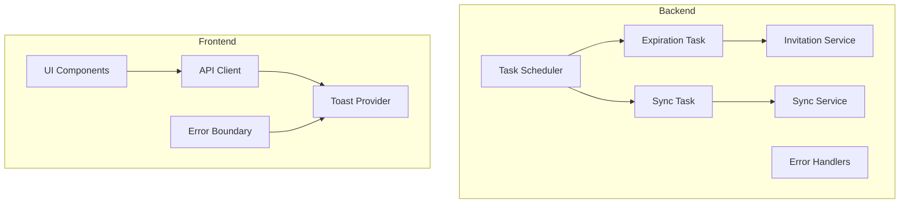

# Design Document: Phase 6 Polish

## Overview

Phase 6 Polish completes Zondarr with production-ready features: automated background tasks for maintenance, comprehensive error handling with toast notifications, improved test coverage, and basic documentation. This phase builds on the existing layered architecture without introducing new domain concepts.

The implementation follows Zondarr's established patterns:
- **Backend**: Litestar with msgspec DTOs, SQLAlchemy async repositories, and structured logging
- **Frontend**: SvelteKit with Svelte 5 Runes, shadcn-svelte components, and svelte-sonner for toasts

## Implementation Guidelines

**CRITICAL**: All implementation MUST strictly follow the project's coding guidelines:

- **Backend (Python/Litestar)**: Follow `.augment/rules/backend-dev-pro.md`
  - Python 3.14+ features (deferred annotations, NOT `from __future__ import annotations`)
  - msgspec Structs for all DTOs (NOT Pydantic)
  - SQLAlchemy 2.0 async patterns with explicit eager loading
  - Litestar class-based controllers with dependency injection
  - basedpyright strict type checking
  - pytest + pytest-asyncio + hypothesis for testing

- **Frontend (Svelte 5/SvelteKit)**: Follow `.augment/rules/frontend-dev-pro.md`
  - Svelte 5 Runes only (`$state`, `$derived`, `$effect`, `$props`)
  - NO legacy patterns (`$:`, `export let`, `<slot>`, writable/readable stores)
  - TypeScript strict mode
  - UnoCSS with presetWind4 + presetShadcn (NOT Tailwind directly)
  - shadcn-svelte components
  - Vitest + fast-check for testing

## Architecture



## Components and Interfaces

### Backend Components

#### Background Task System (`backend/src/zondarr/core/tasks.py`)

Uses Litestar's lifespan context for task scheduling with asyncio:

```python
import asyncio
from contextlib import asynccontextmanager
from datetime import UTC, datetime

import structlog
from litestar import Litestar
from litestar.datastructures import State

from zondarr.config import Settings
from zondarr.repositories.invitation import InvitationRepository
from zondarr.repositories.media_server import MediaServerRepository
from zondarr.repositories.user import UserRepository
from zondarr.services.sync import SyncService

logger: structlog.stdlib.BoundLogger = structlog.get_logger()


class BackgroundTaskManager:
    """Manages periodic background tasks for Zondarr.

    Runs invitation expiration checks and media server synchronization
    at configurable intervals using asyncio tasks.
    """

    _tasks: list[asyncio.Task[None]]
    _running: bool
    settings: Settings

    def __init__(self, settings: Settings, /) -> None:
        self._tasks = []
        self._running = False
        self.settings = settings

    async def start(self, state: State, /) -> None:
        """Start all background tasks."""
        self._running = True

        self._tasks.append(
            asyncio.create_task(
                self._run_expiration_task(state),
                name="invitation-expiration"
            )
        )
        self._tasks.append(
            asyncio.create_task(
                self._run_sync_task(state),
                name="media-server-sync"
            )
        )

        logger.info("Background tasks started")

    async def stop(self) -> None:
        """Stop all background tasks gracefully."""
        self._running = False

        for task in self._tasks:
            task.cancel()

        await asyncio.gather(*self._tasks, return_exceptions=True)
        self._tasks.clear()

        logger.info("Background tasks stopped")

    async def _run_expiration_task(self, state: State, /) -> None:
        """Periodically check and disable expired invitations."""
        interval = self.settings.expiration_check_interval_seconds

        while self._running:
            try:
                await self._check_expired_invitations(state)
            except Exception as exc:
                logger.exception("Expiration task error", exc_info=exc)

            await asyncio.sleep(interval)

    async def _run_sync_task(self, state: State, /) -> None:
        """Periodically sync users with media servers."""
        interval = self.settings.sync_interval_seconds

        while self._running:
            try:
                await self._sync_all_servers(state)
            except Exception as exc:
                logger.exception("Sync task error", exc_info=exc)

            await asyncio.sleep(interval)

    async def _check_expired_invitations(self, state: State, /) -> None:
        """Check for and disable expired invitations."""
        async with state.session_factory() as session:
            repo = InvitationRepository(session)

            now = datetime.now(UTC)
            expired = await repo.get_expired(now)

            disabled_count = 0
            for invitation in expired:
                if invitation.enabled:
                    invitation.enabled = False
                    await repo.update(invitation)
                    disabled_count += 1

            if disabled_count > 0:
                await session.commit()
                logger.info(
                    "Disabled expired invitations",
                    count=disabled_count,
                    checked_at=now.isoformat()
                )

    async def _sync_all_servers(self, state: State, /) -> None:
        """Sync users with all enabled media servers."""
        async with state.session_factory() as session:
            server_repo = MediaServerRepository(session)
            user_repo = UserRepository(session)

            servers = await server_repo.get_enabled()
            sync_service = SyncService(server_repo, user_repo)

            for server in servers:
                try:
                    result = await sync_service.sync_server(server.id)
                    logger.info(
                        "Server sync completed",
                        server_id=str(server.id),
                        server_name=server.name,
                        orphaned=len(result.orphaned_users),
                        stale=len(result.stale_users),
                        matched=result.matched_users
                    )
                except Exception as exc:
                    logger.warning(
                        "Server sync failed",
                        server_id=str(server.id),
                        server_name=server.name,
                        error=str(exc)
                    )


@asynccontextmanager
async def background_tasks_lifespan(app: Litestar):
    """Lifespan context manager for background tasks."""
    settings: Settings = app.state.settings
    manager = BackgroundTaskManager(settings)

    await manager.start(app.state)

    try:
        yield
    finally:
        await manager.stop()
```

#### Configuration Updates (`backend/src/zondarr/config.py`)

Add task interval settings:

```python
class Settings(msgspec.Struct, kw_only=True):
    # ... existing fields ...

    # Background task intervals (in seconds)
    expiration_check_interval_seconds: int = 3600  # 1 hour
    sync_interval_seconds: int = 900  # 15 minutes
```

#### Extended Error Types (`backend/src/zondarr/core/exceptions.py`)

Add external service error:

```python
class ExternalServiceError(ZondarrError):
    """Raised when an external service (media server) fails.

    Includes service identification for debugging.
    """

    service_name: str

    def __init__(
        self, service_name: str, message: str, /, *, original: Exception | None = None
    ) -> None:
        super().__init__(
            message,
            "EXTERNAL_SERVICE_ERROR",
            service_name=service_name
        )
        self.service_name = service_name
        self.original = original
```

#### Extended Error Handler (`backend/src/zondarr/api/errors.py`)

Add handler for external service errors:

```python
from litestar.status_codes import HTTP_502_BAD_GATEWAY
from ..core.exceptions import ExternalServiceError

def external_service_error_handler(
    request: Request[object, object, State],
    exc: ExternalServiceError,
) -> Response[ErrorResponse]:
    """Handle ExternalServiceError exceptions.

    Returns HTTP 502 with service identification.
    """
    correlation_id = _generate_correlation_id()

    logger.warning(
        "External service error",
        correlation_id=correlation_id,
        service_name=exc.service_name,
        path=str(request.url.path),
    )

    return Response(
        ErrorResponse(
            detail=f"External service unavailable: {exc.service_name}",
            error_code=exc.error_code,
            timestamp=datetime.now(UTC),
            correlation_id=correlation_id,
        ),
        status_code=HTTP_502_BAD_GATEWAY,
    )
```

### Frontend Components

#### Toast Provider Setup (`frontend/src/routes/+layout.svelte`)

Integrate svelte-sonner at the root layout:

```svelte
<script lang="ts">
    import '../app.css';
    import { ModeWatcher } from 'mode-watcher';
    import { Toaster } from 'svelte-sonner';

    let { children } = $props();
</script>

<ModeWatcher />
<Toaster
    position="bottom-right"
    richColors
    closeButton
    duration={5000}
/>
{@render children?.()}
```

#### Toast Utility (`frontend/src/lib/utils/toast.ts`)

Centralized toast functions:

```typescript
import { toast } from 'svelte-sonner';

/**
 * Display a success toast notification.
 */
export function showSuccess(message: string, description?: string) {
    toast.success(message, { description });
}

/**
 * Display an error toast notification.
 */
export function showError(message: string, description?: string) {
    toast.error(message, { description });
}

/**
 * Display an error toast from an API error response.
 */
export function showApiError(error: unknown) {
    if (error && typeof error === 'object' && 'detail' in error) {
        const apiError = error as { detail: string; error_code?: string };
        toast.error(apiError.detail, {
            description: apiError.error_code ? `Error code: ${apiError.error_code}` : undefined
        });
    } else if (error instanceof Error) {
        toast.error('An error occurred', { description: error.message });
    } else {
        toast.error('An unexpected error occurred');
    }
}

/**
 * Display a network error toast with retry guidance.
 */
export function showNetworkError() {
    toast.error('Network error', {
        description: 'Please check your connection and try again.'
    });
}

/**
 * Display an info toast notification.
 */
export function showInfo(message: string, description?: string) {
    toast.info(message, { description });
}
```

#### API Client Error Handling (`frontend/src/lib/api/client.ts`)

Add error handling wrapper:

```typescript
import { showApiError, showNetworkError } from '$lib/utils/toast';

/**
 * Wrapper for API calls that handles errors and shows toasts.
 */
export async function withErrorHandling<T>(
    apiCall: () => Promise<{ data?: T; error?: unknown }>,
    options?: { showErrorToast?: boolean }
): Promise<{ data?: T; error?: unknown }> {
    const { showErrorToast = true } = options ?? {};

    try {
        const result = await apiCall();

        if (result.error && showErrorToast) {
            showApiError(result.error);
        }

        return result;
    } catch (error) {
        if (error instanceof TypeError && error.message.includes('fetch')) {
            if (showErrorToast) {
                showNetworkError();
            }
        } else if (showErrorToast) {
            showApiError(error);
        }

        return { error };
    }
}
```

#### Error Boundary Component (`frontend/src/lib/components/error-boundary.svelte`)

Svelte 5 error boundary using snippets:

```svelte
<script lang="ts">
    import type { Snippet } from 'svelte';
    import { Button } from '$lib/components/ui/button';
    import * as Alert from '$lib/components/ui/alert';

    interface Props {
        children: Snippet;
        fallback?: Snippet<[{ error: Error; reset: () => void }]>;
    }

    let { children, fallback }: Props = $props();

    let error = $state<Error | null>(null);

    function handleError(e: Error) {
        error = e;
        console.error('Error boundary caught:', e);
    }

    function reset() {
        error = null;
    }
</script>

{#if error}
    {#if fallback}
        {@render fallback({ error, reset })}
    {:else}
        <Alert.Root variant="destructive">
            <Alert.Title>Something went wrong</Alert.Title>
            <Alert.Description>
                An unexpected error occurred. Please try again.
            </Alert.Description>
            <Button variant="outline" onclick={reset} class="mt-4">
                Try again
            </Button>
        </Alert.Root>
    {/if}
{:else}
    {@render children()}
{/if}
```

### Directory Structure Updates

```
backend/src/zondarr/
├── core/
│   ├── tasks.py           # NEW: Background task manager
│   ├── exceptions.py      # UPDATED: Add ExternalServiceError
│   └── ...
├── api/
│   ├── errors.py          # UPDATED: Add external service handler
│   └── ...
└── ...

frontend/src/
├── lib/
│   ├── utils/
│   │   └── toast.ts       # NEW: Toast utility functions
│   ├── components/
│   │   └── error-boundary.svelte  # NEW: Error boundary component
│   └── ...
├── routes/
│   └── +layout.svelte     # UPDATED: Add Toaster component
└── ...
```

## Data Models

No new data models are introduced in this phase. The background tasks operate on existing models:
- `Invitation`: Checked for expiration, `enabled` field updated
- `MediaServer`: Used to iterate servers for sync
- `User`: Compared during sync operations

## Correctness Properties

*A property is a characteristic or behavior that should hold true across all valid executions of a system—essentially, a formal statement about what the system should do. Properties serve as the bridge between human-readable specifications and machine-verifiable correctness guarantees.*


### Property 1: Expired Invitation Disabling

*For any* set of invitations where some have `expires_at` in the past, running the expiration task SHALL result in all expired invitations having `enabled=false`, while non-expired invitations remain unchanged.

**Validates: Requirements 1.1, 1.2**

### Property 2: Expiration Task Error Resilience

*For any* batch of invitations being processed for expiration, if processing one invitation throws an error, the remaining invitations SHALL still be processed.

**Validates: Requirements 1.5**

### Property 3: Sync Identifies Discrepancies

*For any* media server with a set of external users and a set of local user records, the sync operation SHALL correctly identify orphaned users (on server but not local) and stale users (local but not on server).

**Validates: Requirements 2.1, 2.6, 2.7**

### Property 4: Sync Task Error Resilience

*For any* set of media servers being synced, if syncing one server fails, the remaining servers SHALL still be synced.

**Validates: Requirements 2.5**

### Property 5: Error Response Structure

*For any* error returned by the API, the response body SHALL contain `detail` (string), `error_code` (string), and `timestamp` (ISO datetime string).

**Validates: Requirements 3.1**

### Property 6: Validation Error Field Mapping

*For any* validation error with field-level errors, the API response SHALL include a `field_errors` array where each entry contains the field name and associated error messages.

**Validates: Requirements 3.3**

### Property 7: NotFound Error Resource Identification

*For any* NotFoundError raised with a resource type and identifier, the API response SHALL include the resource type in the error detail message.

**Validates: Requirements 3.4**

### Property 8: External Service Error Mapping

*For any* ExternalServiceError raised with a service name, the API response SHALL return HTTP 502 and include the service name in the error detail.

**Validates: Requirements 3.5**

### Property 9: API Error Toast Display

*For any* API error response, the frontend error handling SHALL extract the error message and display it via toast notification.

**Validates: Requirements 4.4, 5.1**

### Property 10: Form Validation Error Display

*For any* form submission that returns validation errors with field_errors, the UI SHALL display error messages adjacent to the corresponding form fields.

**Validates: Requirements 5.2**

### Property 11: Error Boundary Containment

*For any* error thrown within an error boundary, the error SHALL be caught and the fallback UI SHALL be rendered instead of crashing the application.

**Validates: Requirements 5.4**

### Property 12: Error Message Safety

*For any* error displayed to users, the message SHALL NOT contain stack traces, file paths, or internal implementation details.

**Validates: Requirements 5.5**

## Error Handling

### Backend Error Handling

| Error Condition | HTTP Status | Error Code | Response |
|----------------|-------------|------------|----------|
| Validation error | 400 | VALIDATION_ERROR | `{"detail": "...", "error_code": "VALIDATION_ERROR", "field_errors": [...]}` |
| Resource not found | 404 | NOT_FOUND | `{"detail": "{ResourceType} not found: {id}", "error_code": "NOT_FOUND"}` |
| Database error | 500 | INTERNAL_ERROR | `{"detail": "An internal error occurred", "error_code": "INTERNAL_ERROR"}` |
| External service error | 502 | EXTERNAL_SERVICE_ERROR | `{"detail": "External service unavailable: {service}", "error_code": "EXTERNAL_SERVICE_ERROR"}` |

### Frontend Error Handling

| Error Type | Toast Type | Message Pattern |
|------------|------------|-----------------|
| API validation error | Error | Field-specific message from `detail` |
| API not found | Error | Resource not found message |
| API server error | Error | "An error occurred" with correlation ID |
| Network error | Error | "Network error - please check your connection" |
| Unexpected error | Error | "An unexpected error occurred" |

### Background Task Error Handling

- Individual invitation expiration failures are logged and skipped
- Individual server sync failures are logged and skipped
- Task-level errors are logged but don't stop the scheduler
- All errors include correlation IDs for traceability

## Testing Strategy

### Backend Testing (pytest + hypothesis)

**Property-Based Tests** (`backend/tests/property/`):

1. `test_expiration_props.py` - Invitation expiration task properties
   - Property 1: Expired invitations are disabled
   - Property 2: Error resilience during batch processing

2. `test_sync_props.py` - Media server sync properties (existing, extend)
   - Property 3: Discrepancy identification
   - Property 4: Error resilience across servers

3. `test_error_props.py` - Error handling properties (existing, extend)
   - Property 5: Response structure validation
   - Property 6: Validation error field mapping
   - Property 7: NotFound resource identification
   - Property 8: External service error mapping

**Unit Tests**:
- Edge cases for expiration date boundary conditions
- Empty server list handling
- Malformed error response handling

### Frontend Testing (Vitest + fast-check)

**Property-Based Tests** (`frontend/src/lib/**/*.test.ts`):

1. `toast.test.ts` - Toast utility properties
   - Property 9: API error extraction and display

2. `error-boundary.test.ts` - Error boundary properties
   - Property 11: Error containment

**Component Tests**:
- Toast notification rendering
- Error boundary fallback rendering
- Form validation error display

**Integration Tests**:
- API client error handling flow
- Toast display after API operations

### Test Configuration

**Backend** (`pyproject.toml`):
```toml
[tool.pytest.ini_options]
asyncio_mode = "auto"
asyncio_default_fixture_loop_scope = "function"

[tool.hypothesis]
max_examples = 100
```

**Frontend** (`vite.config.ts`):
```typescript
test: {
    environment: 'jsdom',
    setupFiles: ['./vitest-setup.ts'],
    include: ['src/**/*.{test,spec}.{js,ts}']
}
```

## README Structure

The README.md at repository root will contain:

```markdown
# Zondarr

Unified invitation and user management for Plex and Jellyfin media servers.

## Quick Start

### Backend
```bash
cd backend
uv sync
uv run granian zondarr.app:app --interface asgi --reload
```

### Frontend
```bash
cd frontend
bun install
bun --bun run dev
```

## Tech Stack

- **Backend**: Python 3.14+, Litestar, SQLAlchemy, Granian
- **Frontend**: Bun, SvelteKit, Svelte 5, UnoCSS, shadcn-svelte
- **Database**: SQLite (dev) / PostgreSQL (prod)
```
