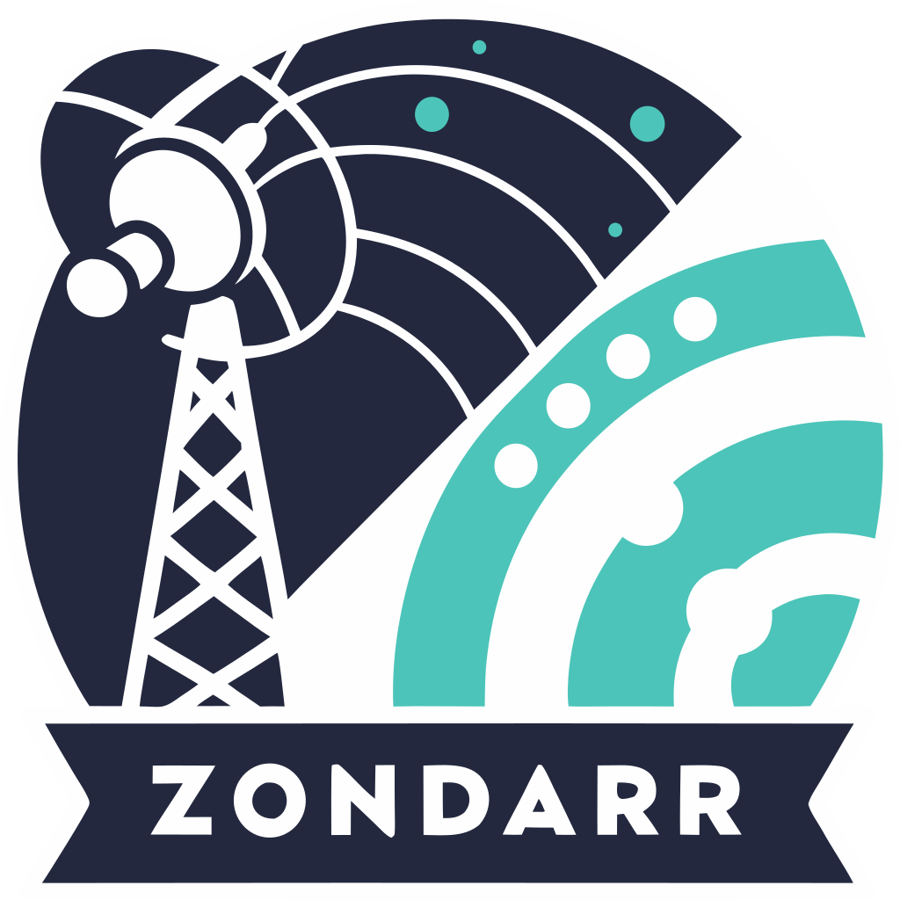

  

<h1 align="center">Zondarr</h1>

  <strong>Unified invitation and user management for Plex and Jellyfin media servers</strong>

  
  
  
  
  
  

## WIP
...

## License
GNU Affero General Public License v3.0
